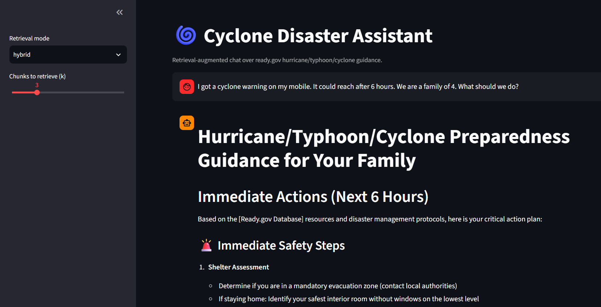
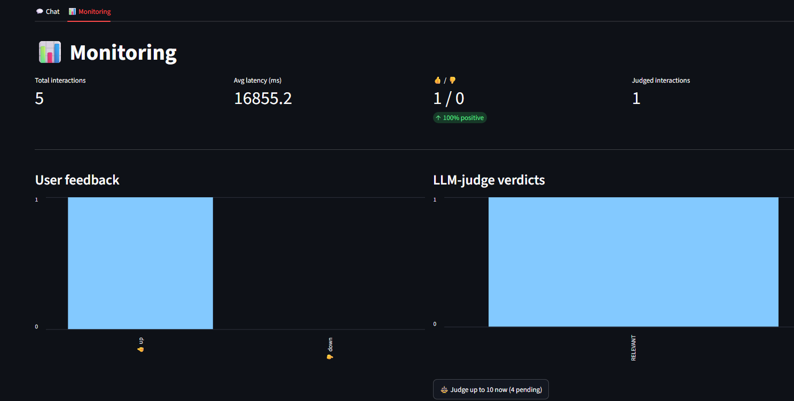

# Cyclone Assistance RAG (in English)

[](https://staysafe-rcck6gpz6ununqj2pe2vbg.streamlit.app/)

RAG assistant with information database from ready.gov hurricane/typhoon/cyclone guidance: crawl → chunk → embed → **Elasticsearch** (hybrid retrieval) → **NVIDIA-hosted LLM** → Streamlit chat, with a ground-truth retrieval eval, LLM-as-a-judge relevance scoring, thumbs feedback, and a monitoring dashboard.

Originally a flow with Chroma + Ollama pipeline was used. However in order to make it available as an online app, a new flow was adapted (using free resources). Some artifact components of the local deployment are retained here so that I may refer back to these for future projects.

## Demo

*(Free tier — the app sleeps after inactivity; first visit may take ~30-60s to wake up.)*




---

## App flow: Step by step (as deployed online)

### A. One-time ingestion utilizing Kestra — local and offline, but its output is used to feed the online database

```
ingest/crawl.py  →  ready_raw.db (pages table)        [local SQLite file, on local machine]
       ↓
ingest/chunk.py  →  ready_raw.db (chunks table: ~300 chunks from ~50 pages)
       ↓
ingest/index_supabase.py  →  Supabase Postgres `chunks` table
                              (each row: chunk_text + a 384-dim pgvector embedding)

```

1. **Crawl** (`ingest/crawl.py`) — BFS-crawls ready.gov from /hurricanes, respecting robots.txt, pulling HTML and PDF (via pypdf), converting to Markdown, filtering to English. Writes to a local SQLite pages table and crawled pages capped at `--max-pages`.
2. **Chunk** (`ingest/chunk.py`) — splits by Markdown header, then by token count (800/150 overlap). Writes to the local chunks table.
3. **Index** (`ingest/index_es.py`) — embeds every chunk locally (sentence-transformers/all-MiniLM-L6-v2), then inserts into Supabase — creating the pgvector extension, the table, an HNSW index, and a full-text GIN index on first run. 


Ingestion is to be triggered manually from a terminal on a local machine (python -m ingest.crawl → chunk → index_supabase), whenever online data is to be refreshed (no automation)

(In the intitial approach ingest/index_es.py was the equivalent step for locally-run Elasticsearch instead of Supabase, for developing against on a local docker compose setup. This was replaced in the new flow for online deployment.)

### B. Live chat, one user turn

```
	   User question, via the public Streamlit URL
   │
   ▼
rag/supabase_retriever.py :: retrieve(query, mode="hybrid")   [rag/retriever.py dispatches here]
   │   ├─ keyword_search()  → Postgres full-text (tsvector/ts_rank) on chunk_text
   │   ├─ vector_search()   → embed query, pgvector cosine search on embedding
   │   └─ hybrid_search()   → both, fused via Reciprocal Rank Fusion (RRF) in Python
   ▼
rag/chat.py :: build_messages()
   │   Wraps retrieved chunks in a system prompt instructing the model to tag
   │   every claim "[Ready.gov Database]" (from CONTEXT) or "[General Knowledge]"
   ▼
rag/llm_client.py :: generate()
   │   Calls the NVIDIA-hosted generator model (20s timeout, 2 retries)
   ▼
app/streamlit_app.py
   │   Renders the answer, logs the turn to Supabase's `interactions` table
   │   (question, answer, retrieval_mode, latency_ms) via metrics/supabase_db.py
   ▼
Thumbs 👍/👎 (optional) → written back onto that same Supabase row
```

Retrieval mode (`hybrid` / `vector` / `keyword`) and `k` (chunks retrieved) are adjustable live from the sidebar — useful for observing the difference hybrid search makes on the same question.

(In the previous local version, use of RETRIEVAL_BACKEND=elasticsearch/METRICS_BACKEND=sqlite in the local .env, instead goes through rag/es_retriever.py and a local metrics.db file with same app/streamlit_app.py, rag/chat.py )

### C. Judging (deliberately decoupled from the chat turn above)

Since scoring an answer's relevance means a *second* LLM call it is separately triggered to keep response time low. 

```
Supabase `interactions` rows with judge_verdict = NULL
       │
       ▼
eval/llm_judge.py :: judge_answer(question, answer) → strict JSON verdict
       ▼
metrics/supabase_db.py :: log_judge_result()   → written back to Supabase
```

Triggered by:
- **CLI**: `python -m eval.llm_judge --mode logged` (all unjudged rows, up to `--limit`)
- **The Streamlit Monitoring tab's "⚖️ Judge up to 10 now" button** — same function, just triggered from the UI, capped at 10 per click 

## How the test question set was generated

`eval/generate_ground_truth.py` builds the evaluation question set directly from the ingested corpus rather than by hand:

1. Randomly samples chunks from the local `chunks` table (SQLite), skipping very short ones (under 200 characters) that are unlikely to contain a full answer.
2. For each sampled chunk, sends its text to the judge model (`nvidia/nemotron-3-ultra-550b-a55b`) with a prompt asking it to write **one specific, realistic question that this passage — and only this passage — directly and fully answers**, answerable without needing information from elsewhere in the corpus.
3. Saves each `(question, expected_chunk_id, expected_url, expected_page_title)` pair to `eval/ground_truth.json`.

Default set size is 30 questions (one per sampled chunk) — enough to compute meaningful Hit Rate/MRR numbers for a ~300-chunk corpus without being slow or expensive to generate.

This question set is then reused for two separate evaluations:
- **Retrieval quality** (`eval/retrieval_eval.py`) — does the *expected* chunk actually come back in the top-k results, under each retrieval mode?
- **Answer quality** (`eval/llm_judge.py --mode ground-truth`) — is the *real* answer the live pipeline generates for each question judged relevant?

```bash
python -m eval.generate_ground_truth --num-questions 30


